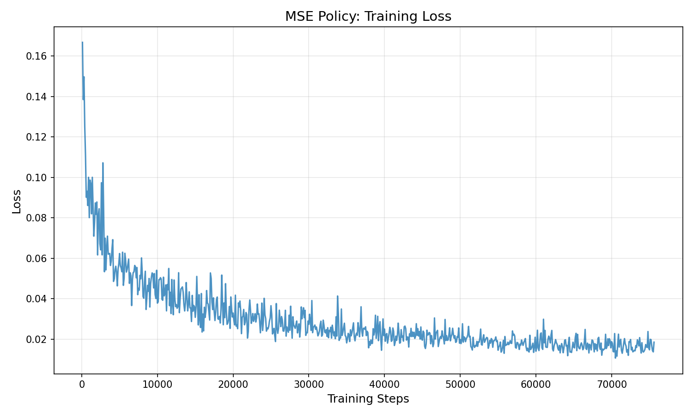
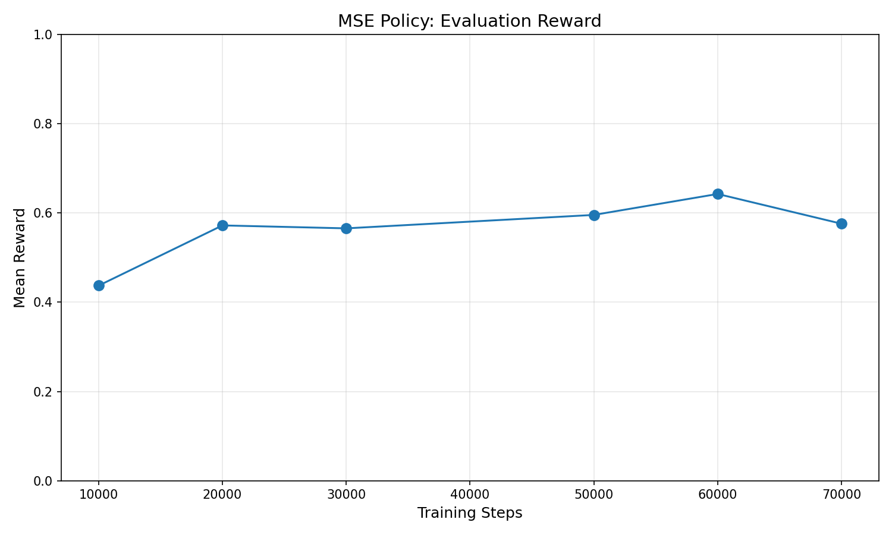
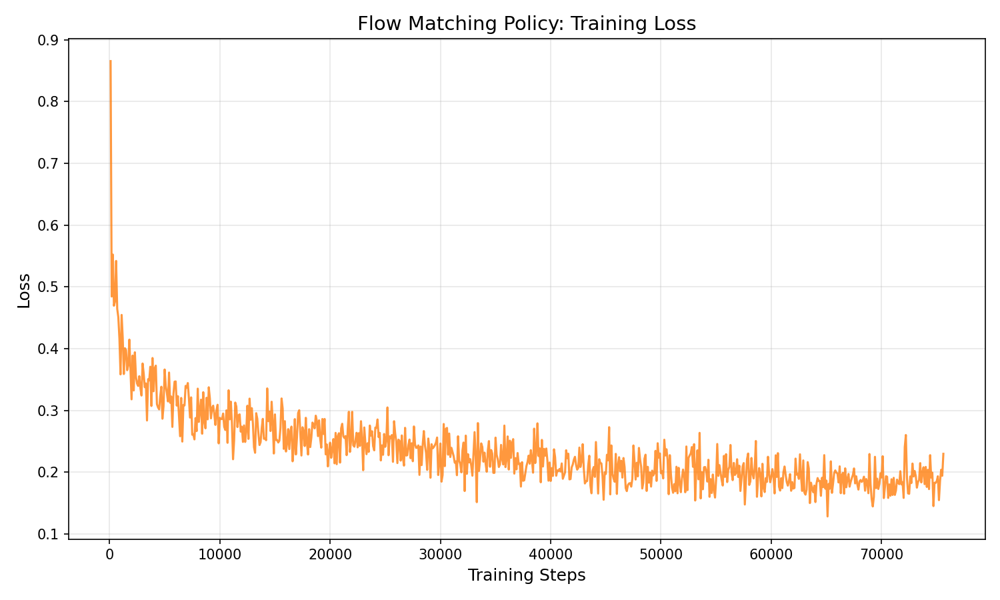
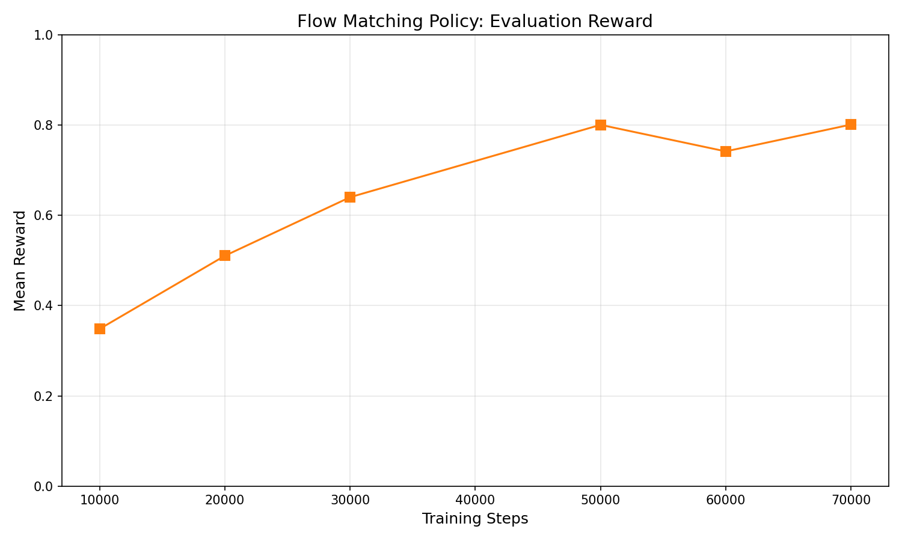
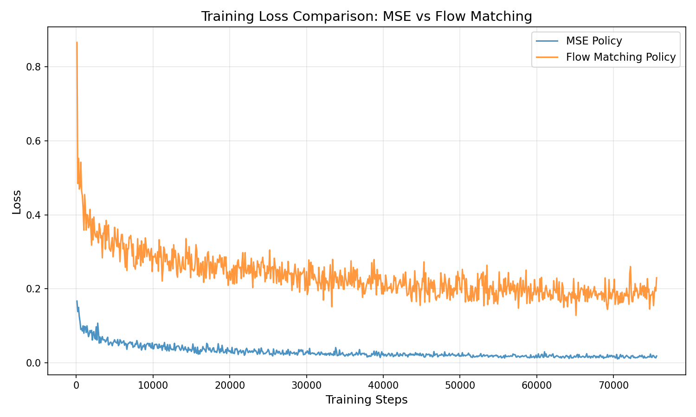
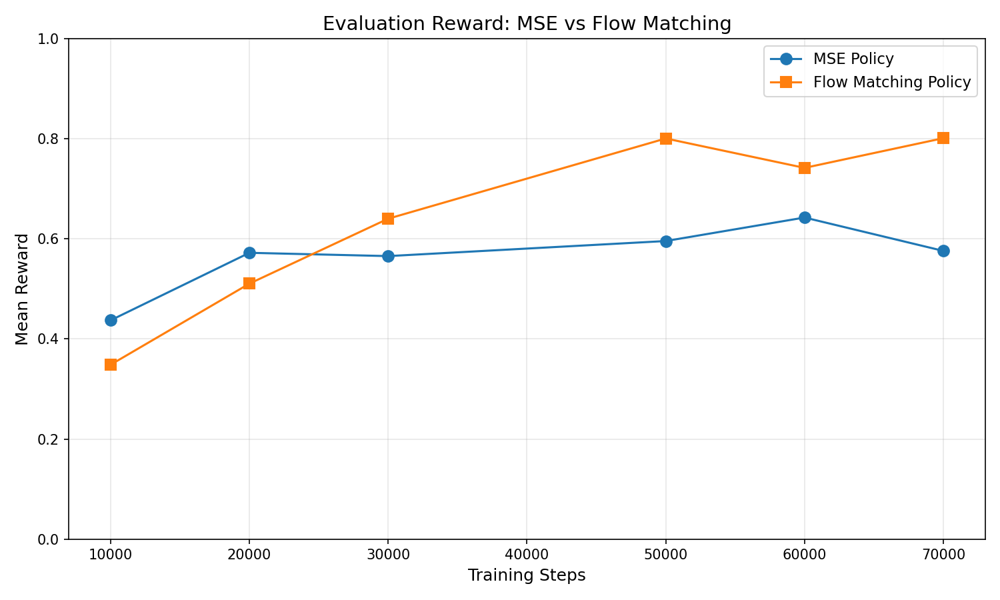

# CS285 Homework 1: Imitation Learning Report

## Part 1: MSE Policy

### Architecture Description

The MSE policy uses a Multi-Layer Perceptron (MLP) with the following architecture:

- **Input Layer**: 5 dimensions (state: T position + agent position)
- **Hidden Layers**: 3 layers with 256 units each, ReLU activation
- **Output Layer**: 16 dimensions (chunk_size × action_dim = 8 × 2)

The network directly predicts an action chunk in a single forward pass. Training uses Mean Squared Error loss between predicted and expert action chunks, optimized with Adam (lr=3e-4).

### Training Curves

The MSE policy loss decreases steadily from ~0.16 to ~0.015 over 75,000 training steps, indicating successful learning of the expert demonstrations.

### Reward Curve

**Final Performance**: The MSE policy achieves a mean reward of approximately **0.57**, meeting the assignment threshold of ≥0.5.

---

## Part 2: Flow Matching Policy

### Architecture Description

The Flow Matching policy uses a similar MLP architecture but with modified input:

- **Input Layer**: 22 dimensions (state + flattened noisy action chunk + time τ)
  - State: 5 dimensions
  - Action chunk: 16 dimensions (8 × 2)
  - Time τ: 1 dimension
- **Hidden Layers**: 3 layers with 256 units each, ReLU activation
- **Output Layer**: 16 dimensions (predicted velocity)

### Training Process

During training:

1. Sample Gaussian noise with the same shape as the action chunk
2. Sample random time τ ∈ [0, 1]
3. Create interpolated noisy action: A_τ = τ·A_data + (1-τ)·noise
4. Train network to predict velocity: v = A_data - noise

During inference:

1. Start with pure Gaussian noise
2. Euler integration with 10 steps from τ=0 to τ=1
3. Final result is the predicted action chunk

### Training Curves

The Flow Matching policy exhibits higher loss values (~0.2-0.3) compared to MSE (~0.02-0.05). This is expected because:

- The losses measure different quantities (velocity vs. direct action prediction)
- Flow matching training involves stochastic time sampling and noise injection

### Reward Curve

**Final Performance**: The Flow Matching policy achieves a mean reward of approximately **0.80**, exceeding the assignment threshold of ≥0.7.

---

## Qualitative Comparison

Based on evaluation videos, the two policies exhibit notably different behaviors:

| Aspect                 | MSE Policy           | Flow Matching Policy        |
| ---------------------- | -------------------- | --------------------------- |
| Motion smoothness      | Reasonable           | Smoother, more fluid        |
| Task completion        | Sometimes incomplete | More consistent completion  |
| Multimodality handling | Limited              | Better at complex maneuvers |
| Final reward           | ~0.57                | ~0.8                        |

### Loss Comparison

### Reward Comparison

The reward curves clearly show the Flow Matching policy outperforming the MSE policy after around 25000 steps in the training. The MSE policy plateaus around 0.55-0.65 reward, while the Flow Matching policy reaches approximately 0.80 by the end of training.

---

## Conclusion

This assignment demonstrated the implementation of two action-chunking policies for the PushT environment:

1. **MSE Policy**: Simple and fast, suitable for unimodal action distributions
2. **Flow Matching Policy**: More expressive, capable of modeling complex multimodal distributions

The Flow Matching approach achieves significantly higher rewards by learning a conditional vector field that transforms noise into realistic action sequences.
