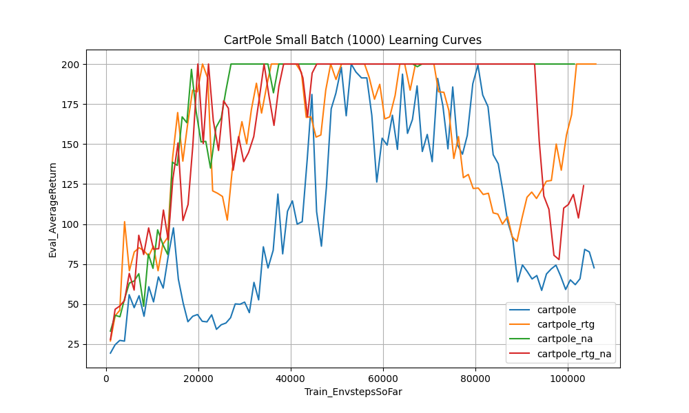
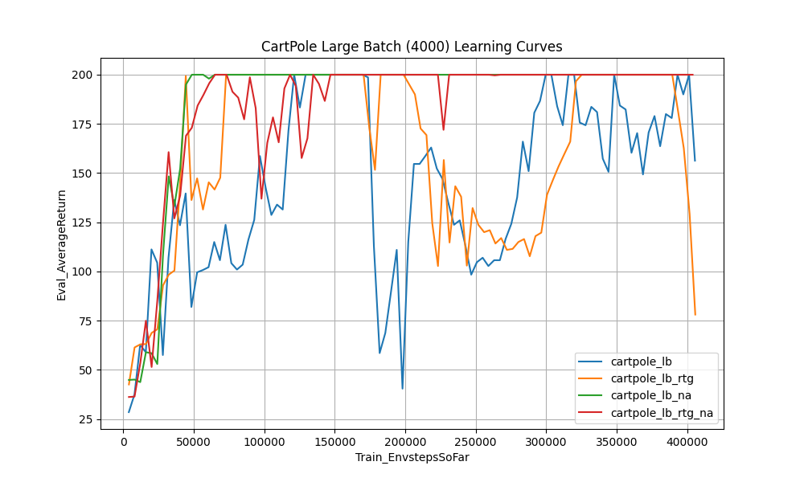
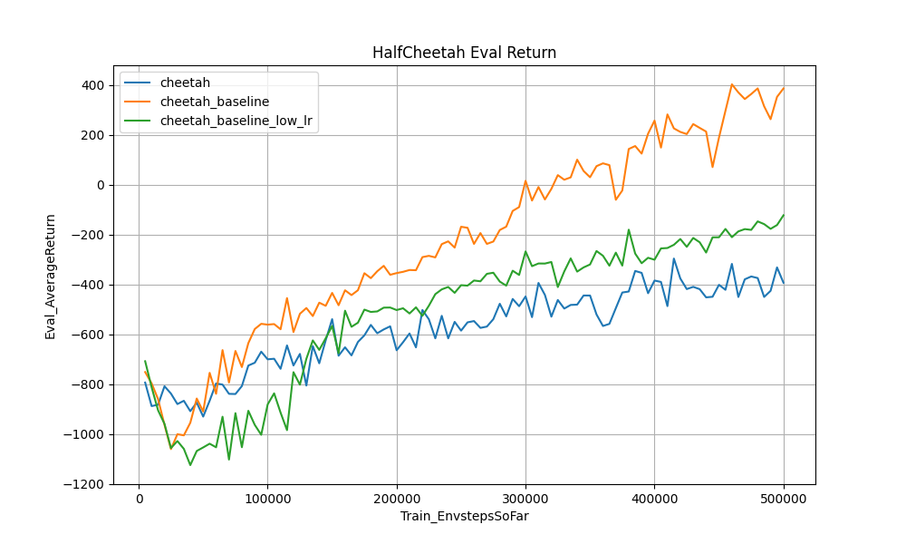
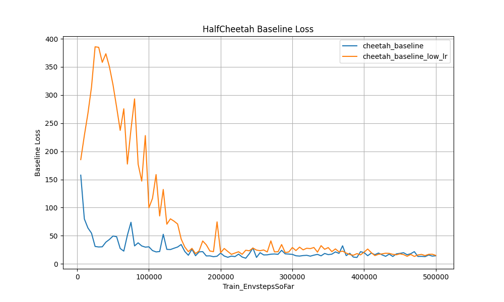
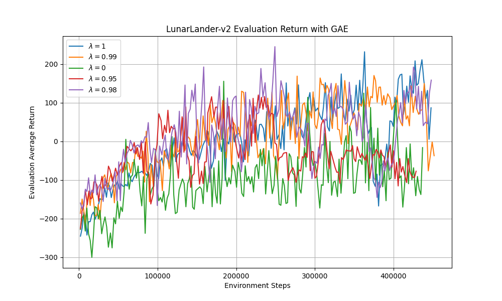
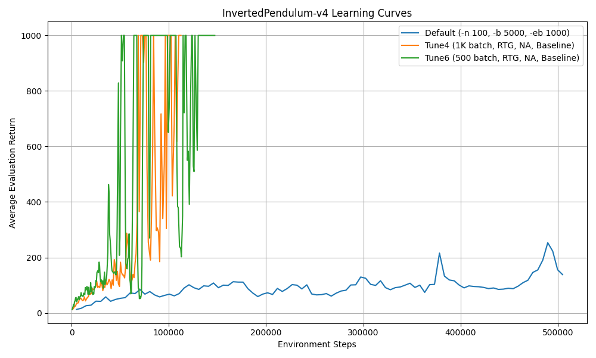

# CS285 Homework 2: Policy Gradients

> Tao Sun, 3041937629

## Experiment 1 (CartPole)

### Logs of Final Evaluation and Training Returns (Iteration 100)

- **cartpole:**
  - Eval\_AverageReturn: 72.67
  - Train\_AverageReturn: 78.62
- **cartpole_rtg:**
  - Eval\_AverageReturn: 200.00
  - Train\_AverageReturn: 200.00
- **cartpole_na:**
  - Eval\_AverageReturn: 200.00
  - Train\_AverageReturn: 200.00
- **cartpole_rtg_na:**
  - Eval\_AverageReturn: 124.00
  - Train\_AverageReturn: 123.89
- **cartpole_lb:**
  - Eval\_AverageReturn: 156.33
  - Train\_AverageReturn: 189.14
- **cartpole_lb_rtg:**
  - Eval\_AverageReturn: 78.14
  - Train\_AverageReturn: 121.70
- **cartpole_lb_na:**
  - Eval\_AverageReturn: 200.00
  - Train\_AverageReturn: 200.00
- **cartpole_lb_rtg_na:**
  - Eval\_AverageReturn: 200.00
  - Train\_AverageReturn: 200.00

### Learning Curves





### Analysis Questions

**1. Which value estimator has better performance without advantage normalization: the trajectory-centric one, or the one using reward-to-go?**

- The Reward-to-Go (`rtg`) estimator demonstrates better and more stable performance than the trajectory-centric estimator. For example, in the small batch experiments, `cartpole_rtg` learned quickly and maintained a maximum score of 200, whereas the baseline `cartpole` reached 200 but ultimately dropped back down to 72 by the final iteration.

**2. Between the two value estimators, why do you think one is generally preferred over the other?**

- Reward-to-Go is generally preferred because it has strictly lower variance. It exploits causality by noting that an action cannot affect rewards received in the past. By dropping these past reward terms from the policy gradient equation, it removes unnecessary noise from the gradient estimate, leading to more stable policy updates.

**3. Did advantage normalization help?**

- Yes, advantage normalization significantly helped stabilize learning. Comparing models without advantage normalization to those with it, the `na` models consistently hit 200 and rarely catastrophicly unlearned the policy. Normalization centers and scales the advantages, reducing the impact of highly varying reward scales across different batches and smoothing out the optimization landscape.

**4. Did the batch size make an impact?**

- Yes, batch size had a noticeable impact on the learning process. The large batch models (`lb`, 4000 steps) exhibit less variance and much smoother learning curves than the small batch models (1000 steps). While both can reach the maximum reward, small batch sizes suffer from noisier gradient estimates resulting in jagged convergence. However, large batches require significantly more environment interactions per iteration.

### Command Line Configurations

```bash
uv run src/scripts/run.py --env_name CartPole-v0 -n 100 -b 1000 --exp_name cartpole
uv run src/scripts/run.py --env_name CartPole-v0 -n 100 -b 1000 -rtg --exp_name cartpole_rtg
uv run src/scripts/run.py --env_name CartPole-v0 -n 100 -b 1000 -na --exp_name cartpole_na
uv run src/scripts/run.py --env_name CartPole-v0 -n 100 -b 1000 -rtg -na --exp_name cartpole_rtg_na
uv run src/scripts/run.py --env_name CartPole-v0 -n 100 -b 4000 --exp_name cartpole_lb
uv run src/scripts/run.py --env_name CartPole-v0 -n 100 -b 4000 -rtg --exp_name cartpole_lb_rtg
uv run src/scripts/run.py --env_name CartPole-v0 -n 100 -b 4000 -na --exp_name cartpole_lb_na
uv run src/scripts/run.py --env_name CartPole-v0 -n 100 -b 4000 -rtg -na --exp_name cartpole_lb_rtg_na
```

## Experiment 2 (HalfCheetah)

### Logs of Final Evaluation and Training Returns (Iteration 100)

- **cheetah (no baseline):**
  - Eval\_AverageReturn: -393.18
  - Train\_AverageReturn: -347.24
- **cheetah_baseline (`-blr 0.01`):**
  - Eval\_AverageReturn: 385.39
  - Train\_AverageReturn: 309.06
- **cheetah_baseline_low_lr (`-blr 0.001`):**
  - Eval\_AverageReturn: -122.82
  - Train\_AverageReturn: -126.35

### Learning Curves





### Analysis Questions

**How does a decreased baseline learning rate affect (a) the baseline learning curve and (b) the performance of the policy?**

- **(a) Baseline Learning Curve:** The baseline loss curve for the decreased learning rate (`-blr 0.001`) decreases much more slowly and smoothly compared to the default learning rate (`-blr 0.01`). With the default learning rate, the baseline loss rapidly drops to around 15 within the first few iterations, whereas with the lower learning rate, it takes much longer to drop and converges much higher, at around 15.
- **(b) Performance of the Policy:** The policy with the decreased baseline learning rate struggles to learn as quickly and consistently. Its evaluation return is around -120 by iteration 100, which is significantly worse than the default baseline learning rate runs that achieved evaluation returns above 300. The slow-learning baseline prevents it from providing accurate advantage estimates early in training, resulting in higher variance policy updates and poorer overall performance.

### Command Line Configurations

```bash
uv run src/scripts/run.py --env_name HalfCheetah-v4 -n 100 -b 5000 -eb 3000 -rtg --discount 0.95 -lr 0.01 --exp_name cheetah
uv run src/scripts/run.py --env_name HalfCheetah-v4 -n 100 -b 5000 -eb 3000 -rtg --discount 0.95 -lr 0.01 --use_baseline -blr 0.01 -bgs 5 --exp_name cheetah_baseline
uv run src/scripts/run.py --env_name HalfCheetah-v4 -n 100 -b 5000 -eb 3000 -rtg --discount 0.95 -lr 0.01 --use_baseline -blr 0.001 -bgs 5 --exp_name cheetah_baseline_low_lr
```

## Experiment 3 (LunarLander)

### Learning Curves



### Analysis Questions

**1. Describe in words how λ affected task performance.**

- The value of λ significantly impacts performance. Intermediate values of λ (e.g., 0.95, 0.98, 0.99) generally achieved the highest and most stable final evaluation returns. The policy with $\lambda=0.99$ successfully reached an average return near 200. Conversely, extreme values of λ performed worse. $\lambda=1.0$ exhibited high variance and slower initial learning, while $\lambda=0.0$ failed to learn a good policy, plateauing at a very low return.

**2. Consider the parameter λ. What does λ = 0 correspond to? What about λ = 1? Relate this to the task performance in LunarLander-v2.**

- **$\lambda=0$** corresponds to using only the single-step TD error (the advantage estimate is exactly $r_t + \gamma V(s_{t+1}) - V(s_t)$). This is highly biased by the critic's value predictions and has very low variance. In LunarLander, the high bias prevents the agent from properly learning the complex sequence of actions needed to land, leading to poor performance.
- **$\lambda=1$** corresponds to using the standard Monte Carlo return baseline (the advantage estimate is the full sum of empirical rewards minus the baseline). This is unbiased but has very high variance. In LunarLander, the high variance from long, noisy trajectories makes the gradient updates unstable, making it harder to consistently converge to an optimal landing policy.

### Command Line Configurations

```bash
uv run src/scripts/run.py --env_name LunarLander-v2 --ep_len 1000 --discount 0.99 -n 200 -b 2000 -eb 2000 -l 3 -s 128 -lr 0.001 --use_reward_to_go --use_baseline --gae_lambda 1.0 --exp_name lunar_lander_lambda1
uv run src/scripts/run.py --env_name LunarLander-v2 --ep_len 1000 --discount 0.99 -n 200 -b 2000 -eb 2000 -l 3 -s 128 -lr 0.001 --use_reward_to_go --use_baseline --gae_lambda 0.99 --exp_name lunar_lander_lambda0.99
uv run src/scripts/run.py --env_name LunarLander-v2 --ep_len 1000 --discount 0.99 -n 200 -b 2000 -eb 2000 -l 3 -s 128 -lr 0.001 --use_reward_to_go --use_baseline --gae_lambda 0.98 --exp_name lunar_lander_lambda0.98
uv run src/scripts/run.py --env_name LunarLander-v2 --ep_len 1000 --discount 0.99 -n 200 -b 2000 -eb 2000 -l 3 -s 128 -lr 0.001 --use_reward_to_go --use_baseline --gae_lambda 0.95 --exp_name lunar_lander_lambda0.95
uv run src/scripts/run.py --env_name LunarLander-v2 --ep_len 1000 --discount 0.99 -n 200 -b 2000 -eb 2000 -l 3 -s 128 -lr 0.001 --use_reward_to_go --use_baseline --gae_lambda 0.0 --exp_name lunar_lander_lambda0
```

## Experiment 4 (InvertedPendulum)

### Tuned Hyperparameters and Analysis

**1. Best Run Log**

- The experiment reaching maximum performance fastest is the following configuration. The associated training log was saved, successfully achieving a 1000 average evaluation return in 51,316 environment steps.

**2. Best Set of Hyperparameters and Exact Command Line Configuration**

- The best set of hyperparameters discovered is:
  - **Iterations (`-n`)**: 200
  - **Batch Size (`-b`)**: 500
  - **Eval Batch Size (`-eb`)**: 1000
  - **Reward-to-Go (`-rtg`)**: True
  - **Advantage Normalization (`-na`)**: True
  - **Baseline (`--use_baseline`)**: True
- **Which hyperparameters mattered**:
  - **Batch Size and Iterations**: Smaller batch sizes with more total iterations (`-b 500`, `-n 200`) enabled much faster, more frequent parameter updates. This heavily reduced sample inefficiency compared to slower, massive batches (`-b 5000` with `-n 100`), without degrading the sample gradient too much.
  - **Reward-to-go and Baseline**: Incorporating causality with `rtg` and subtracting a learned `baseline` significantly reduced variance in the gradient directions, leading to swift, stable learning instead of wandering.
  - **Advantage Normalization**: Normalizing advantages smoothed out gradients when reward scales grew dramatically towards 1000, preventing gradient explosion.

### Learning Curves



### Command Line Configuration

```bash
uv run src/scripts/run.py --env_name InvertedPendulum-v4 -n 200 -b 500 -eb 1000 -rtg -na --use_baseline --exp_name pendulum_tune6
```
