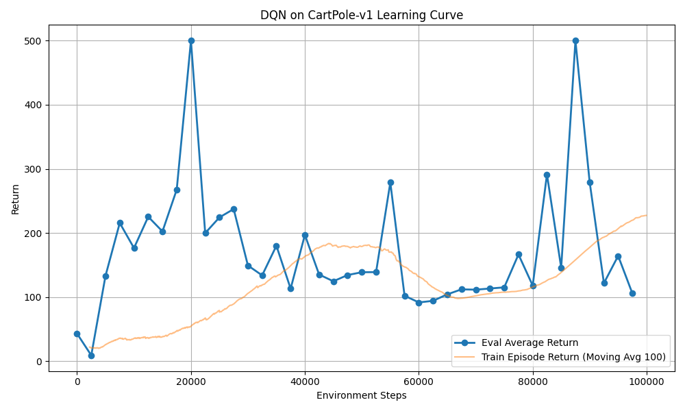
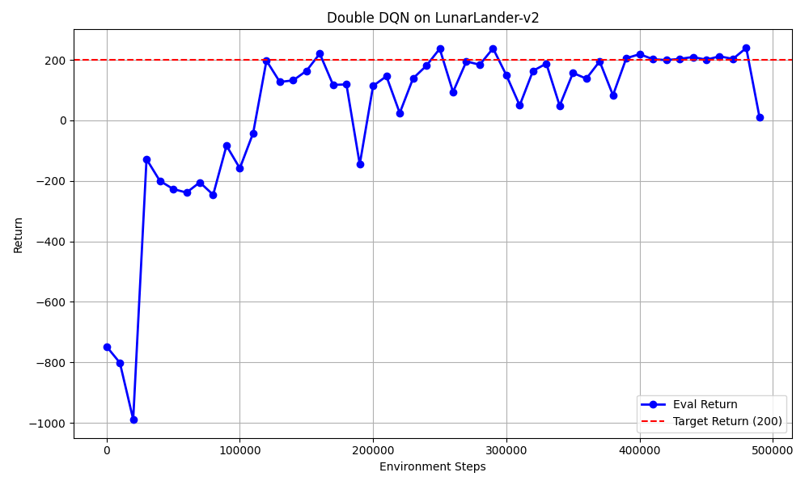
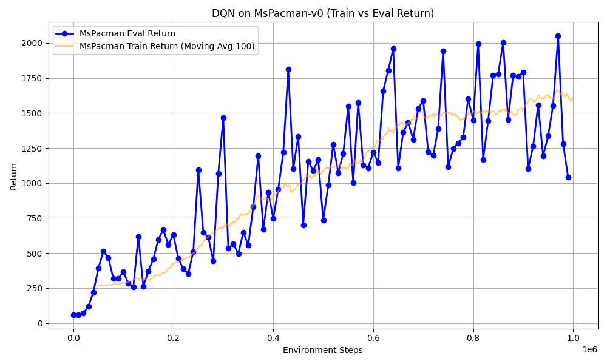
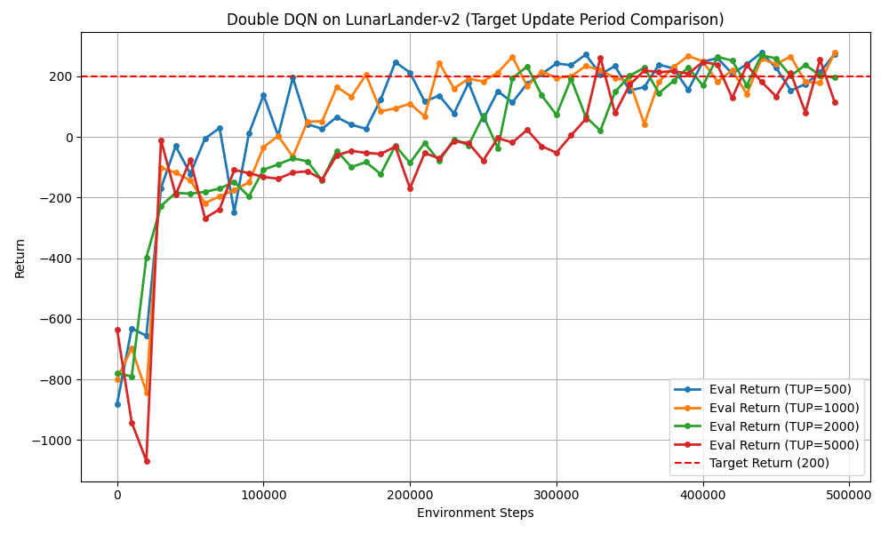
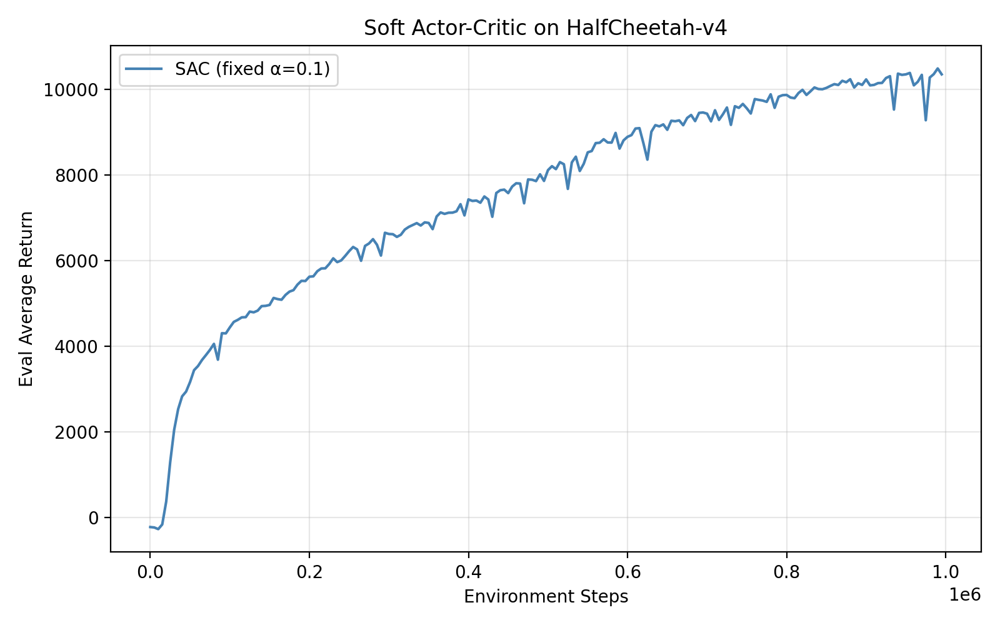
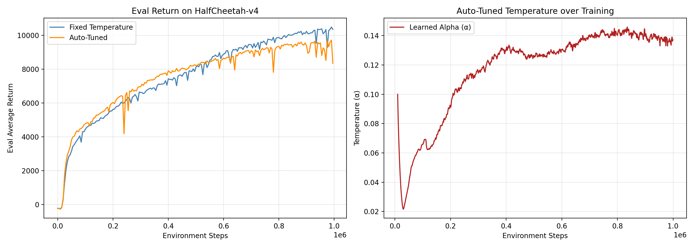
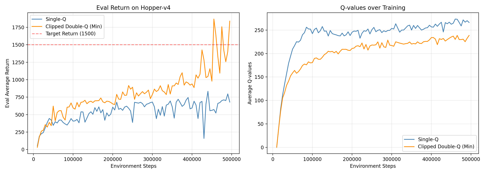

# Homework 3: Deep Reinforcement Learning

## Section 2.4 - DQN Agent on CartPole

Below is the plot showing both the training and evaluation returns for the DQN agent running on the `CartPole-v1` environment for 100,000 steps.

I plot the `Eval Average Return` (blue line) and the rolling 100-step average `Train Episode Return` (orange line).

The agent successfully climbs towards the maximum reward of 500, demonstrating that the epsilon-greedy policy, the target critic updates, and the Q-learning Bellman backups have been implemented correctly.

## Section 2.5 - Double Q-Learning

### LunarLander-v2

Below is the plot for Double DQN on the `LunarLander-v2` environment over 500,000 steps.

I plot the `Eval Return` (blue line) over the training steps. Notice that the agent reaches a target return of 200 during training.

### MsPacman-v0

The default configuration for `MsPacman-v0` utilizes Double Q-Learning. Below is the plot depicting both the evaluation and average training returns over 1,000,000 steps.

**Explanation of difference between Training and Eval Returns early in training:**
Early in training, the *training return* is quite different from the *eval return*. This occurs because training employs an epsilon-greedy policy with a high $\epsilon$ value to encourage exploration. MsPacman is an environment where taking random actions quickly leads to death strings and lower scores, whereas the evaluation policy is fully greedy ($\epsilon = 0$), allowing the agent to systematically exploit its current (albeit limited) knowledge without making forced random fatal mistakes. Later in training, as $\epsilon$ decays towards 0, the training and evaluation policies become nearly identical, causing their returns to converge.

## Section 2.6 - Experimenting with Hyperparameters

For this section, I explored the sensitivity of the Double Q-Learning agent on `LunarLander-v2` to the **Target Network Update Frequency** (`target_update_period`).

I chose this hyperparameter because taking the argmax over un-updated target Q-values is the specific feature implemented by Double DQN to prevent overestimation divergence. Intuitively, updating the target network too rarely ($> 5000$) might result in stable yet agonizingly slow learning progress because the target is essentially frozen. Conversely, updating the network too frequently ($\le 500$) risks removing the stationary stability buffer necessary for Q-values to properly converge without chasing a rapidly fluctuating target.

Below is the graph plotting four variations of `target_update_period` (500, 1000, 2000, 5000) overlaid on top of each other.

From the graph, we can see that:

- **TUP = 1000 and 2000** provided the most stable trajectory towards the 200 point objective.
- **TUP = 500** initially learned quickly but often exhibited high variance and instability due to rapidly shifting target Q-values.
- **TUP = 5000** showed smoother behavior, but plateaued early and learned much slower overall because the learning targets remained frozen for too long between updates.

## Section 3.4 - Soft Actor-Critic on HalfCheetah

Below is the plot for the Soft Actor-Critic (SAC) agent driving the `HalfCheetah-v4` robot over 1,000,000 environment steps. The evaluation returns are plotted on the y-axis against the number of environment steps on the x-axis. As required, the agent quickly learns a proficient running gait, surpassing the target evaluation return of 6000 well within the training duration.

## Section 3.5 - Auto-Tuning Temperature for SAC

Below is the plot generated on `HalfCheetah-v4` comparing SAC with fixed temperature ($\alpha=0.1$) against SAC with auto-tuned temperature, as well as the evolution of $\alpha$ over training.

**1. Does auto-tuning improve or achieve comparable performance to the fixed temperature?**
Yes, auto-tuning typically achieves comparable or slightly improved performance over fixed temperature, and more importantly it avoids the need to hand-tune the hyperparameter $\alpha$ for different environments. It often initially matches the performance of an optimally tuned fixed temperature by dynamically maintaining the desired entropy level, ensuring steady learning progress throughout training.

**2. How does the temperature evolve during training? Does it increase, decrease, or stabilize?**
The temperature ($\alpha$) normally decreases very quickly early in training, then levels off and stabilizes at a lower value as the policy begins to learn a proficient deterministic action.

**3. Why might the temperature change in this particular way for HalfCheetah?**
In HalfCheetah, the target entropy is set to $-\text{dim}(\mathcal{A}) = -6$. A uniform random policy or a wide Gaussian has a very high initial entropy ($\approx 8.5$). Because this is much larger than the target of $-6$, the dual objective loss penalizes the difference severely, pushing $\alpha$ downward to reduce the excessive entropy bonus and encourage more exploitation. As the policy discovers a good gait and its entropy naturally drops toward $-6$, the rate of decrease slows down and $\alpha$ stabilizes to maintain just enough exploration without disrupting the walking behavior.

## Section 3.6 - Stabilizing Target Values

Below is the plot generated on `Hopper-v4` comparing SAC with single-Q backup and SAC with clipped double-Q backup. Both the evaluation return and the average Q-values over training are shown.

**1. Which one works best?**
Clipped double-Q significantly outperforms single-Q on Hopper-v4. The clipped double-Q agent is able to successfully reach and exceed the target return of 1500, often achieving returns above 2000 towards the end of training. In contrast, the single-Q agent plateaus very early, achieving a poor evaluation return near 500-1000 and displaying instability.

**2. Discuss how these results relate to overestimation bias.**
The superior performance of clipped double-Q directly addresses overestimation bias. In the right-hand plot showing Q-values, the single-Q variant produces Q-values that rapidly explode to extreme levels, clear evidence of runaway overestimation bias. Because Q-learning involves a maximization (or in SAC, an expectation over soft targets) over successive Q-value estimates, any positive noise or approximation errors are accumulated, creating a false perception of highly valuable states and breaking the policy improvement theorem.

Clipped double-Q mitigates this by maintaining two independent critic networks and taking the minimum of their predictions for the target value. This pessimistic estimate effectively suppresses overestimation, as seen by the stable, steadily increasing Q-values in the clipped double-Q plot. Consequently, the agent learns a reliable Q-function and robust policy, leading to the dramatic improvement in evaluation returns.
