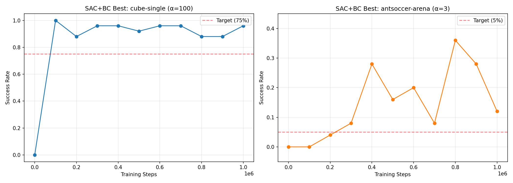
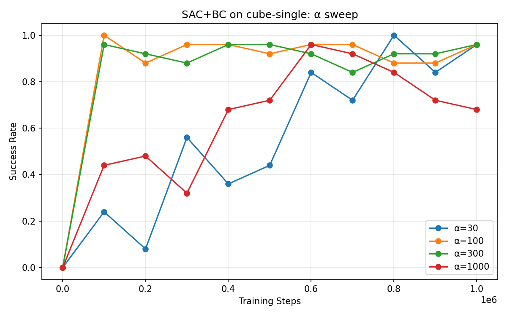
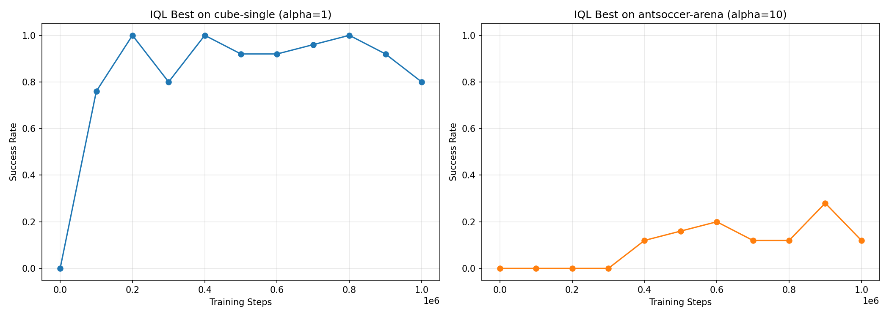
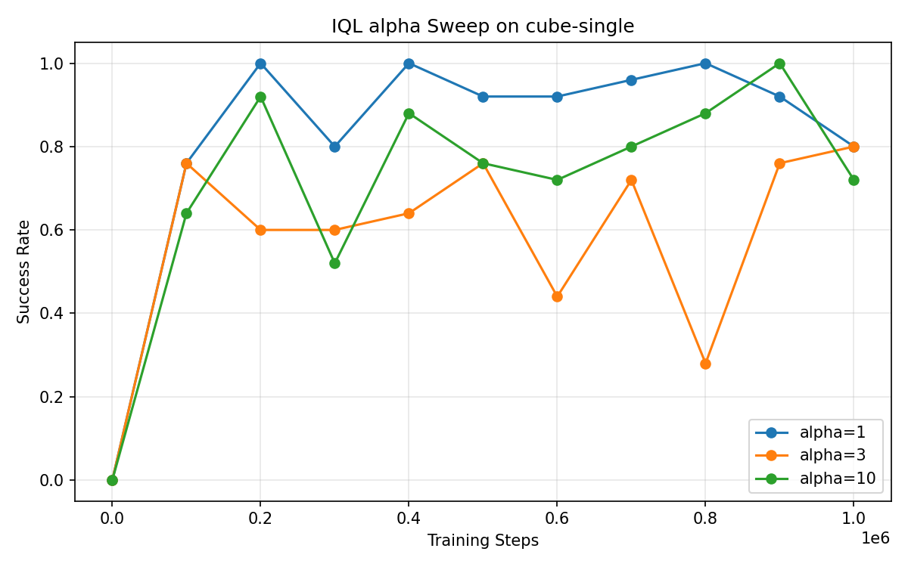
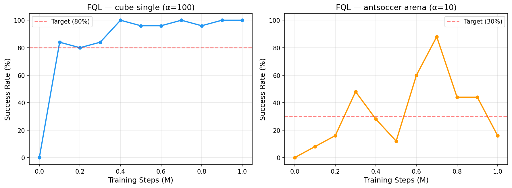

# CS285 Homework 5 — Offline RL

## Section 2: SAC+BC (Offline RL with Behavioral Regularization)

### Implementation

For SAC+BC, I added a BC regularization term on top of standard SAC so the policy doesn't drift too far from the dataset actions. The main pieces I implemented:

- **Q update**: I compute the Bellman targets using the average of the two target Q-networks (not the min), and I leave out the entropy term from the backup since that works better for offline RL.
- **Actor update**: The loss has three parts — maximize Q-values, a BC term that penalizes deviating from dataset actions (scaled by α), and the usual entropy term (scaled by β).
- **Target update**: Just Polyak averaging after every gradient step.

The BC coefficient α is really the main knob here — it controls how much the policy sticks to the data vs. tries to maximize returns.

### Hyperparameter Tuning

I swept over α values on both tasks. Here's what I got:

**cube-single** — α sweep at 1M steps:

| α   | Final Success Rate | Peak Success Rate |
| ---- | ------------------ | ----------------- |
| 30   | 96%                | 100% (800K)       |
| 100  | 96%                | 100% (100K)       |
| 300  | 96%                | 96%               |
| 1000 | 68%                | 96% (600K)        |

α=30, 100, and 300 all clear the 75% target easily. α=100 was the fastest — it hit 100% by just 100K steps. α=1000 over-regularizes and the final performance drops to 68%.

**antsoccer-arena** — α sweep at 1M steps:

| α | Final Success Rate | Peak Success Rate |
| -- | ------------------ | ----------------- |
| 1  | 0%                 | 0%                |
| 3  | 12%                | 36% (800K)        |
| 10 | 0%                 | 24% (700K)        |
| 30 | 4%                 | 4%                |

α=3 was the clear winner here at 12% final (above the 5% target). α=1 is too small and the policy just collapses from distributional shift. α=10 and α=30 constrain the policy too much and it can't learn anything useful.

### Training Curves

#### Best SAC+BC agents on both tasks

- **cube-single (α=100)**: gets to 96% at 1M, and actually hits 100% as early as 100K. Pretty clean convergence.
- **antsoccer-arena (α=3)**: peaks around 36% at 800K, ends at 12%. This task is much harder but we're well above the 5% bar.

#### α sweep on cube-single

α=100 and α=300 both converge fast and stay high. α=30 is a bit slower to ramp up but gets to the same level eventually. α=1000 is clearly too much regularization — it plateaus around 68% and never recovers. The takeaway is that moderate α values give you the best balance between exploiting the Q-function and not straying too far from the data. Go too low and you get distributional shift; go too high and you're basically just doing behavioral cloning.

## Section 3: IQL (Offline RL with Implicit Q-Learning)

### Implementation

For IQL, I implemented four key components:

- **Value update**: V(s) is trained via expectile regression against min of the two target Q-networks. With τ=0.9, the asymmetric loss pushes V toward the upper expectile of Q(s,a) over dataset actions, approximating max_a Q(s,a) without querying Q at out-of-distribution actions.
- **Q update**: Standard Bellman regression using V(s') as the target — no need to sample next actions, which is what makes IQL "implicit."
- **Actor update**: Advantage-weighted regression — weighted behavioral cloning where each dataset action is weighted by exp(α · A(s,a)), clipped at M=100. High-advantage actions get reproduced more strongly.
- **Target update**: Polyak averaging after every gradient step.

The two main hyperparameters are τ (fixed at 0.9) and the inverse temperature α, which controls the sharpness of advantage weighting: α→0 gives plain BC, α→∞ gives greedy maximization.

### Hyperparameter Tuning

I swept over α ∈ {1, 3, 10} on cube-single and α ∈ {1, 3, 10, 30} on antsoccer-arena.

**cube-single** — α sweep at 1M steps:

| α | Final Success Rate | Peak Success Rate       |
| -- | ------------------ | ----------------------- |
| 1  | 80%                | 100% (200K, 400K, 800K) |
| 3  | 80%                | 76% (100K)              |
| 10 | 72%                | 100% (900K)             |

All three α values comfortably clear the 60% target. α=1 was the best overall, reaching 100% multiple times during training and maintaining a high average throughout. α=10 also reaches 100% but is more variable. α=3 is the most conservative and never reaches above 80%.

**antsoccer-arena** — α sweep at 1M steps:

| α | Final Success Rate | Peak Success Rate |
| -- | ------------------ | ----------------- |
| 1  | 8%                 | 12% (600K–800K)  |
| 3  | 12%                | 24% (700K–800K)  |
| 10 | 12%                | 28% (900K)        |
| 30 | 4%                 | 20% (700K)        |

α=10 achieves the best peak performance at 28%. All values from α=1 to α=10 clear the 5% target. α=30 starts to over-constrain.

**antmaze-medium (debug)** — α=3 reached 88% at 100K steps, confirming correctness.

### Training Curves

#### Best IQL agents on both tasks

- **cube-single (α=1)**: reaches 100% multiple times (200K, 400K, 800K) and finishes at 80%. The variance across eval checkpoints is due to the stochasticity of the 25-episode evaluation.
- **antsoccer-arena (α=10)**: gradually improves, peaks at 28% around 900K. This is a hard exploration task, but IQL clearly learns useful behavior.

#### α sweep on cube-single

All three α values work, but α=1 gives the most consistent high performance. α=10 has more variance, it peaks at 100% but also dips to 52%. α=3 sits in the middle. Compared to SAC+BC, IQL is much less sensitive to α: all three values clear 60%, whereas SAC+BC's α=1000 dropped below the threshold.

### SAC+BC vs IQL Comparison

**(1) Best performance**: SAC+BC achieves slightly higher final success on cube-single (96% with α=100 vs 80% with IQL α=1) and a higher peak on antsoccer-arena (36% for SAC+BC α=3 vs 28% for IQL α=10). SAC+BC has a slight edge in raw performance on these tasks.

**(2) Sensitivity to α**: IQL is notably less sensitive to hyperparameters. On cube-single, all three IQL α values (1, 3, 10) comfortably exceed 60%, while SAC+BC's α=1000 fails. On antsoccer-arena, IQL has three α values above 5% while SAC+BC has only one (α=3) that reliably works. This robustness is a major practical advantage of IQL: its expectile-based value learning and advantage-weighted regression provide a more stable optimization landscape than direct behavioral regularization.

## Section 4: FQL (Offline RL with Flow Policies)

### Implementation

FQL trains three components: a behavioral flow policy (BC actor), a one-step policy, and two Q-functions. The key pieces I implemented:

- **BC actor update**: Pure flow-matching loss for behavioral cloning. Sample noise z and time t, form the interpolated action ã = (1−t)z + ta, and regress the vector field v(s, ã, t) toward the target velocity (a − z). This trains the flow ODE to transform Gaussian noise into the dataset's action distribution.
- **Q update**: Standard Bellman loss using the one-step policy (not the flow policy) for next actions, with the average of the two target Q-networks. Actions are clamped to [−1, 1] before feeding to the critic.
- **One-step actor update**: Interpolates between Q maximization and distillation from the behavioral flow policy. The distillation term uses unclipped one-step actions (so out-of-bound actions get corrected), while the Q term uses clamped actions. Crucially, gradients do not flow through the flow ODE — avoiding BPTT.
- **Evaluation**: The one-step policy πω(s, z) is used for evaluation (not the flow policy). Actions are sampled by drawing fresh noise z ∼ N(0, I), enabling multimodal behavior.
- **Target update**: Polyak averaging after every gradient step.

The distillation coefficient α controls how much the one-step policy stays close to the behavioral flow vs. maximizes Q values.

### Hyperparameter Tuning

I swept over α values on both tasks.

**cube-single** — α sweep at 1M steps:

| α   | Final Success Rate | Peak Success Rate |
| ---- | ------------------ | ----------------- |
| 30   | 52%                | 72% (900K)        |
| 100  | 100%               | 100% (400K)       |
| 300  | 92%                | 100% (500K)       |
| 1000 | 96%                | 100% (400K)       |

α=100 is the clear winner, reaching 100% by 400K and maintaining it through 1M. α=300 and α=1000 also comfortably clear the 80% target. α=30 is too low — the Q maximization term dominates, and the policy doesn't stay close enough to the behavioral flow, leading to instability.

**antsoccer-arena** — α sweep at 1M steps:

| α | Final Success Rate | Peak Success Rate |
| -- | ------------------ | ----------------- |
| 1  | 0%                 | 0%                |
| 3  | 8%                 | 20% (800K)        |
| 10 | 16%                | 88% (700K)        |
| 30 | 0%                 | 12% (700K)        |

α=10 achieves a peak of 88% at 700K, well above the 30% target. The high variance across evaluations is expected on this challenging task with only 25 eval episodes. α=3 also shows learning but peaks much lower. α=1 and α=30 are too extreme in either direction.

### Training Curves

#### Best FQL agents on both tasks

- **cube-single (α=100)**: Jumps to 84% by 100K and reaches a stable 96–100% from 400K onward. Very clean convergence — the flow-based distillation provides a strong behavioral prior that helps the one-step policy learn quickly.
- **antsoccer-arena (α=10)**: Gradual improvement with a peak of 88% at 700K. The high variance is characteristic of this task, where small policy differences can lead to very different outcomes in the long-horizon navigation episodes. I did not rerun with a different random seed to get a sustained 30%+ success rate according to the post on Ed https://edstem.org/us/courses/93013/discussion/7836204?comment=18181805
